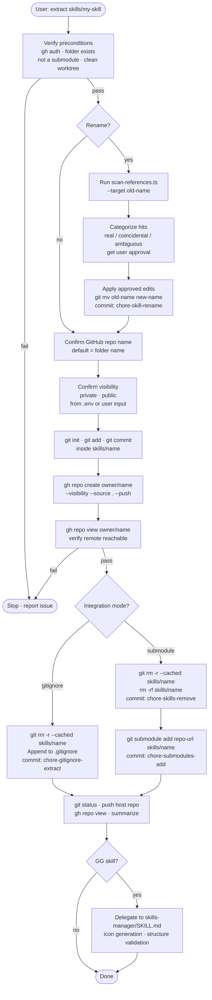

# extractor
Local-only meta-skill that extracts a `skills/` folder into a standalone GitHub repository. It optionally renames the skill and rewrites all internal references first, then re-integrates the new repo back into the host project as either a gitignored local clone or a git submodule.

This folder is gitignored from the parent repo. It exists only on the user's workstation and is invoked by Claude Code when the user asks to extract a skill.

## Install

The fastest cross-agent install path is the `skills` CLI:

```bash
npx skills add gg-skills/extractor
```

Drop this skill into a workspace as a Git submodule for pinned versions, or as a plain clone for latest `main`:

```bash
# Project-local, version-pinned:
git submodule add git@github.com:gg-skills/extractor.git .claude/skills/extractor

# OR project-local, latest main:
mkdir -p .claude/skills
git -C .claude/skills clone git@github.com:gg-skills/extractor.git

# OR user-level, available in every project on this machine:
mkdir -p ~/.claude/skills
git -C ~/.claude/skills clone git@github.com:gg-skills/extractor.git
```

Restart your agent or reload skills after installation. See the parent [`skills` catalog repo](https://github.com/gg-skills/skills) for the full catalog.

## When to use

- User asks to "extract", "spin off", or "give its own repo to" a folder under `skills/`.
- User wants to rename a skill and update all internal references before extracting.
- Need to convert an in-repo skill folder to a submodule at its current path.
- Need to untrack a skill from the host project while keeping it locally editable.

**Skip when:** the target is already a submodule, batch extraction of multiple skills is requested, or the target does not exist under `skills/`.

## How it operates

### Inputs

- **Target folder** — an existing plain folder under `skills/` (e.g. `skills/ide-sync`). Must not contain a `.git/` directory and must not appear in `.gitmodules`.
- **Host repo state** — the parent working tree must be clean before extraction begins. The skill reads `.gitmodules` and the root `.gitignore` to know what is already tracked.
- **`.env` defaults** — `skills/extractor/.env` (falls back to `.env.example`). Provides starting values for `GH_EXTRACTOR_GITHUB_OWNER`, `GG_EXTRACTOR_DEFAULT_VISIBILITY`, and `GG_EXTRACTOR_DEFAULT_INTEGRATION`. These are offered as suggestions only; the agent always prompts for explicit confirmation.

### Outputs

Two mutually exclusive outcomes depending on the integration mode chosen:

| Mode | What ends up on disk | What changes in the host repo |
|------|---------------------|-------------------------------|
| **gitignore** | Skill folder stays in place as a standalone local git clone | One new line added to root `.gitignore`; folder untracked from index |
| **submodule** | Skill folder is removed and re-added as a submodule pointing at the new GitHub URL | `.gitmodules` entry added; parent `git add .gitmodules skills/<name>` |

In both modes a new remote GitHub repository is created and the skill's initial contents are pushed to it.

### External commands

The skill drives the following tools — Claude Code runs these via Bash; no manual invocation is needed:

| Command | Purpose |
|---------|---------|
| `gh auth status` | Pre-flight: verify GitHub CLI is authenticated |
| `gh repo create <owner>/<name> --<visibility> --source . --remote origin --push` | Create the new GitHub repo and push the initial commit in one step |
| `gh repo view <owner>/<name>` | Verify the remote is reachable after push |
| `git init -b main && git add . && git commit -m "Initial commit"` | Bootstrap a local git repo inside the skill folder before pushing |
| `git rm -r --cached skills/<name>` | Untrack the folder from the host index (both modes) |
| `git mv <old> <new>` | Rename the folder in the host repo when a rename is requested |
| `git submodule add <repo-url> skills/<name>` | Re-add the skill as a submodule (submodule mode only) |
| `rm -rf skills/<name>` | Remove the working tree before submodule add (submodule mode only) |
| `npx tsx skills/extractor/scripts/scan-references.ts --target <name>` | Find all references to the skill name across the repo before renaming |
| `sed` / file edits | Rewrite approved reference hits after the user confirms categorization |

### Side effects

- **Creates a remote GitHub repository** under the configured owner (`GG_EXTRACTOR_GITHUB_OWNER`, default `gg-skills`).
- **Modifies the host repo's `.gitignore`** (gitignore mode) or **`.gitmodules`** (submodule mode).
- **Mutates file references** across the host repo when a rename is requested and approved (e.g. updating `SKILL.md` slugs, import paths, or CI workflow names that contained the old folder name).
- **Commits to the host repo** — typically 1–3 commits: rename commit (optional), untrack commit, and integration commit.
- **Does not push** the host repo automatically; step 8 confirms state first and then pushes.

### Mode toggles

**Rename vs. preserve name:**
- Default: keep existing folder name (e.g. `ide-sync` becomes the GitHub repo `gg-skills/ide-sync`).
- If rename is requested, the scan script runs first, every hit is categorized (real / coincidental / ambiguous), the user approves changes, then `git mv` renames the folder and approved files are edited.

**Gitignore vs. submodule re-integration:**
- **Gitignore mode** (default): the folder stays in its current location as a local-only clone. One line is appended to `.gitignore`. Fast, zero submodule overhead, but changes are not tracked by the host repo.
- **Submodule mode**: the working tree is deleted (`rm -rf`) and re-added via `git submodule add`. The host repo now pins an exact commit of the extracted skill. Every clone of the host must run `git submodule update --init` to materialize the skill.

## Operational flow



## Layout

```
extractor/
├── SKILL.md                    # Procedure Claude follows (9-step workflow)
├── README.md                   # This file
├── configuration.md            # Env-var reference (also at references/)
├── quick-reference.md          # Command cheat sheet (also at references/)
├── troubleshooting.md          # Failure modes and recovery (also at references/)
├── assets/
│   ├── icon-small.svg
│   ├── icon-large.png
│   ├── icon-master.png
│   ├── icon-prompt.txt
│   ├── icon-summary.txt
│   └── icon-metaphor.txt
├── agents/                     # Agent configs (if any)
├── references/
│   ├── quick-reference.md
│   ├── configuration.md
│   └── troubleshooting.md
└── scripts/
    └── scan-references.ts      # Reference scanner (run via npx tsx)
```

## Quick start

```bash
# 1. Verify auth
gh auth status

# 2. Copy env defaults
cp skills/extractor/.env.example skills/extractor/.env
# Edit .env: set GG_EXTRACTOR_GITHUB_OWNER, visibility, integration mode

# 3. Tell Claude to extract a skill
# "Use extractor to extract skills/my-skill"
# Claude will prompt for rename, repo name, visibility, and integration mode.
```

## Resources

- [`SKILL.md`](SKILL.md) — full 9-step extraction procedure with decision tables and non-negotiable policies.
- [`references/quick-reference.md`](references/quick-reference.md) — all `gh`, `git`, and scan commands in one place.
- [`references/configuration.md`](references/configuration.md) — `.env` variable reference and behavior rules.
- [`references/troubleshooting.md`](references/troubleshooting.md) — failure-mode matrix with symptoms and recovery steps.
- [`gg-skills` repo](https://github.com/gg-skills/skills) — parent catalog and bootstrap pattern.

## Caveats

- **One target per invocation.** Multi-skill batch extraction is not supported; run the skill once per folder.
- **Submodule mode is destructive.** The working tree is deleted with `rm -rf` before the submodule is added. The contents are safe on the remote, but the local copy is gone until `git submodule update --init` is run.
- **Reference rewriting requires human review.** The scan script finds all hits but the agent categorizes and the user approves before any file is modified. Slugs that appear as substrings of unrelated identifiers (e.g. `my-skill-config`) require a judgment call.
- **Reference scan > 100 hits.** The agent pauses and asks before continuing — the slug is likely too generic.
- **This skill is gitignored from `gg-skills`.** It is intentionally excluded from the skills sync system and lives only on the user's machine.
- **Post-extraction validation is delegated.** Icon generation and skill structure validation are handled by `skills-manager/SKILL.md`, not by this skill.
